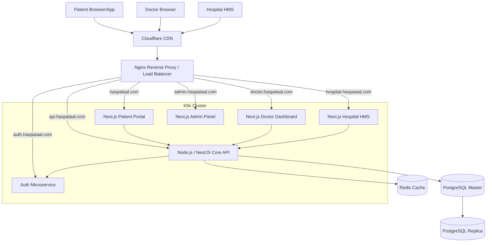

# 🚨 HASPATAAL WAR ROOM: MASTER EXECUTION PLAN

**MISSION:** BUILD PRACTO-SCALE HEALTHCARE PLATFORM INFRASTRUCTURE
**DOMAINS:** `haspataal.com`, `doctor.`, `hospital.`, `admin.`, `api.`, `cdn.`, `auth.`
**TARGET:** 10 Million Users

---

## Deliverable 1: Complete System Architecture Diagram



---

## Deliverable 2: DNS Configuration Guide

All DNS records should be managed via Cloudflare (Proxied) with Wildcard SSL (`*.haspataal.com`).

| Type | Name | Content | Proxy Status | Purpose |
|---|---|---|---|---|
| A | @ | `<Load_Balancer_IP>` | Proxied | Patient Portal |
| A | doctor | `<Load_Balancer_IP>` | Proxied | Doctor Dashboard |
| A | hospital | `<Load_Balancer_IP>` | Proxied | Hospital HMS |
| A | admin | `<Load_Balancer_IP>` | Proxied | Admin Control Panel |
| A | api | `<Load_Balancer_IP>` | Proxied | Core API Routing |
| A | auth | `<Load_Balancer_IP>` | Proxied | JWT Auth Service |
| CNAME | cdn | `haspataal.cdn.cloudflare.net` | DNS Only | Static Assets |

---

## Deliverable 3: Nginx Configuration for Subdomains

```nginx
# Map directives for dynamic upstream routing based on host
map $http_host $upstream_service {
    hostnames;
    haspataal.com                 patient_portal;
    doctor.haspataal.com          doctor_dashboard;
    hospital.haspataal.com        hospital_hms;
    admin.haspataal.com           admin_panel;
    api.haspataal.com             core_api;
    auth.haspataal.com            auth_service;
}

server {
    listen 80;
    listen 443 ssl http2;
    server_name .haspataal.com;

    ssl_certificate /etc/letsencrypt/live/haspataal.com/fullchain.pem;
    ssl_certificate_key /etc/letsencrypt/live/haspataal.com/privkey.pem;

    location / {
        proxy_pass http://$upstream_service;
        proxy_set_header Host $host;
        proxy_set_header X-Real-IP $remote_addr;
        proxy_set_header X-Forwarded-For $proxy_add_x_forwarded_for;
        proxy_set_header X-Forwarded-Proto $scheme;
        
        # Security headers
        add_header X-Frame-Options "SAMEORIGIN";
        add_header Content-Security-Policy "default-src 'self' cdn.haspataal.com";
    }
}
```

---

## Deliverable 4: Database Schema (Multi-Tenant RLS)

```sql
-- Role Enum
CREATE TYPE user_role AS ENUM ('patient', 'doctor', 'hospital_admin', 'super_admin');

-- Master Hospital Tenant Table
CREATE TABLE hospitals (
    id UUID PRIMARY KEY,
    name VARCHAR(255) NOT NULL,
    created_at TIMESTAMP DEFAULT NOW()
);

-- Core Users
CREATE TABLE users (
    id UUID PRIMARY KEY,
    email VARCHAR(255) UNIQUE NOT NULL,
    role user_role NOT NULL,
    hospital_id UUID REFERENCES hospitals(id) NULL -- Null for standard patients
);

-- Appointments (Strict Tenancy)
CREATE TABLE appointments (
    id UUID PRIMARY KEY,
    hospital_id UUID NOT NULL REFERENCES hospitals(id),
    doctor_id UUID NOT NULL REFERENCES users(id),
    patient_id UUID NOT NULL REFERENCES users(id),
    slot_time TIMESTAMP NOT NULL,
    status VARCHAR(50) DEFAULT 'booked'
);

-- Row Level Security (RLS) Policy Example
ALTER TABLE appointments ENABLE ROW LEVEL SECURITY;

CREATE POLICY "Hospital data isolation" ON appointments
    FOR ALL
    USING (hospital_id = current_setting('app.current_hospital_id')::UUID);

CREATE POLICY "Doctors see own patients" ON appointments
    FOR SELECT
    USING (doctor_id = auth.uid());
```

---

## Deliverable 5: API Specification (Core Architecture)

| Subdomain | Endpoint | Method | Role | Purpose |
|---|---|---|---|---|
| `auth.` | `/oauth/token` | POST | All | Request JWT / Verify Auth |
| `api.` | `/v1/search/doctors` | GET | Public | Discovery engine (SEO powered) |
| `api.` | `/v1/appointments` | POST | Patient | Lock slot (Redis) & Create |
| `api.` | `/v1/hospitals/:id/patients` | GET | Hosp. Admin | Retrieve isolated patient list |
| `api.` | `/v1/telemed/session` | POST | Doctor | Initialize WebRTC signaling |

---

## Deliverable 6: Infrastructure Deployment Plan

**Environment:** AWS / Kubernetes (EKS)
1. **Container Registry:** Push Next.js and Node.js images to ECR.
2. **K8s Namspaces:** Create `production`, `staging`, `monitoring`.
3. **Deployments:** Scale Node.js APIs horizontally; Next.js frontend pods.
4. **Data Layer:** AWS RDS for PostgreSQL (Multi-AZ) with Read Replicas. ElastiCache for Redis (Slot locking).
5. **Gateway:** Nginx Ingress Controller managing subdomain routing.

---

## Deliverable 7: CI/CD Workflow

**Tool:** GitHub Actions
```yaml
stages:
  - lint-and-test: Run Zod schemas and Jest stability checks.
  - build-images: Docker build `frontends` and `api`.
  - security-scan: Run Trivy/Snyk on containers for HIPAA compliance.
  - deploy-staging: Deploy to `staging.haspataal.com`.
  - e2e-tests: Run Playwright against staging.
  - deploy-production: Rollout to K8s via ArgoCD (GitOps).
```

---

## Deliverable 8: Security Model

1. **RBAC:** Managed by `auth.haspataal.com`; tokens contain `role` and `hospital_id`.
2. **Database:** PostgreSQL Row Level Security (RLS) physically prevents cross-hospital data leaks.
3. **Data Encryption:** TLS 1.3 in transit. AWS KMS encrypted at rest.
4. **PII Isolation:** Medical records (prescriptions/labs) stored as immutable encrypted JSON/Blobs.
5. **Audit Logs:** All `INSERT/UPDATE/DELETE` triggers copy delta state to `audit_logs` table.

---

## Deliverable 9: Production Deployment Checklist

- [ ] All 5 subdomains routing correctly through Nginx Ingress.
- [ ] Cloudflare proxy enabled with strict TLS.
- [ ] Redis distributed locking confirmed for appointment slots.
- [ ] PostgreSQL RLS policies injected and tested by QA Agent.
- [ ] JWT horizontal scaling (stateless tokens) verified.
- [ ] 0 downtime deployment pipeline confirmed (ArgoCD blue/green).
- [ ] SEO standard metadata generated for `/city/specialty` routes.

---

## Deliverable 10: Scalability Roadmap (To 10M Users)

1. **0 - 1M Users:** Single RDS Master with vertical scaling. Redis for session cache.
2. **1M - 5M Users:** Add 3 Read Replicas. Implement connection pooling (PgBouncer) for `api.`. Switch frontend assets entirely to `cdn.` edge caching.
3. **5M - 10M Users:** Introduce Database Sharding by `city` or region. Devolve the monolithic `api.` into true isolated microservices (Billing, Appointments, Telemed) using Apache Kafka for event-driven states.
---
*Generated by System Architect Agent in War Room Mode*
