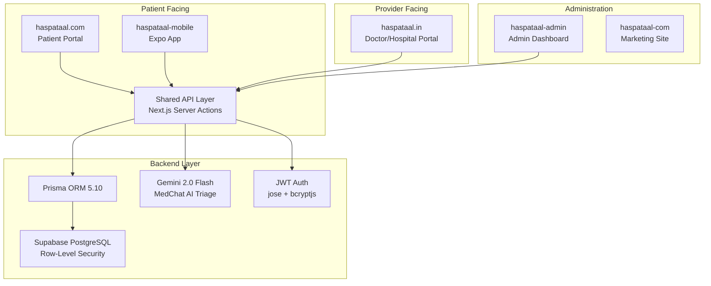

# Haspataal System Architecture

## High-Level Overview



---

## Route Groups (Root App)

| Group | Routes | Auth Required |
|---|---|---|
| `(patient)` | `/`, `/login`, `/hospitals`, `/book`, `/profile`, `/search`, `/medchat` | Partial |
| `(hospital)` | `/hospital/*` (login, register, dashboard, billing, doctors, reports) | Yes |
| `(hospital)` | `/lab/*` (register, dashboard) | Yes |
| `(agent)` | `/agent/*` (login, register, dashboard) | Yes |
| `(doctor)` | `/doctor/register` | Yes |
| `admin` | `/admin`, `/admin/dashboard`, `/admin/dashboard/hospitals` | Yes |

---

## Authentication Flow

```
User Login → bcryptjs password verify → jose JWT sign → HTTP-only cookie
                                                          ↓
                                              Cookie name per role:
                                              session_user
                                              session_patient
                                              session_admin
                                              session_agent
```

---

## Data Flow: MedChat AI Triage

```
Patient Input → Zod Validation → Jailbreak Check
    ↓
Red Flag Scan (deterministic)
    ↓
Symptom Matching → Seasonal/Regional → Pediatric Rules
    ↓
[GEMINI_API_KEY available?]
    ├─ YES → Gemini 2.0 Flash (AI clinical reasoning)
    ├─ NO  → Deterministic score classification
    ↓
Hybrid Result → TOON compression → Response to frontend
```

---

## Database Entities (Key Models)

| Model | Purpose |
|---|---|
| `Patient` | Patient profiles and records |
| `Doctor` | Doctor profiles and credentials |
| `Hospital` | Hospital master data |
| `DoctorHospitalAffiliation` | Many-to-many doctor-hospital relationships |
| `Appointment` | Booking records |
| `Slot` | Doctor availability slots |
| `Visit` | Patient visit history |
| `MedicalRecord` | Digital health records |
| `DiagnosticOrder` | Lab test orders |
| `Agent` | Platform agents/facilitators |
| `Review` | Patient reviews |
| `AuditLog` | Security audit trail |

---

## Shared Code

| Location | Purpose |
|---|---|
| `common/` | Shared services across portals |
| `prisma/schema.prisma` | Single schema for root app |
| `lib/` | Services, auth utilities, Prisma client |
| `lib/medchat/` | MedChat AI engine, schemas, translations |
