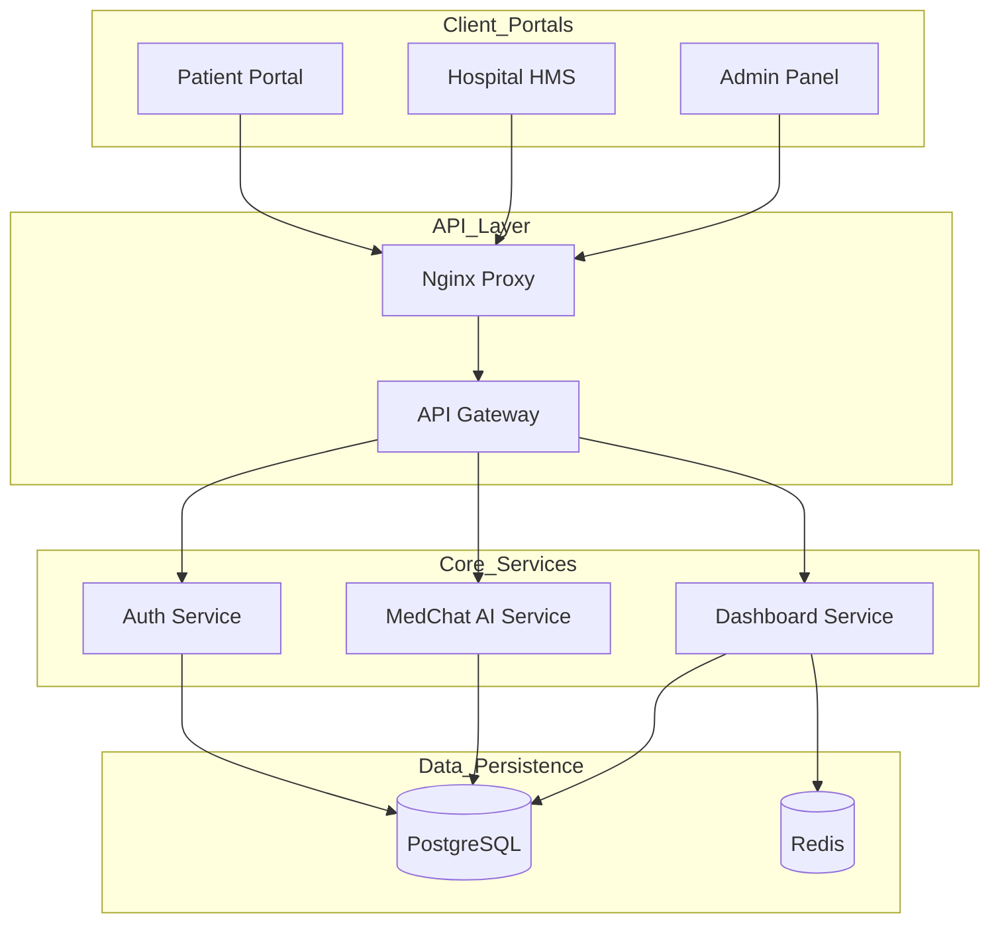

# Haspataal
> The Unified Healthcare Operating System for India.


Haspataal is a comprehensive B2B2C healthcare monorepo that connects patients, doctors, and hospitals through a secure, high-performance platform. Built with Turborepo, Next.js, and Clean Architecture.



## 🚀 Quick Start

Get your local development environment running in 2 minutes:

1. **Clone & Enter**:
    ```bash
    git clone https://github.com/haspataal/haspataal.git && cd haspataal
    ```

2. **Environment Setup**:
    ```bash
    cp .env.example .env.local
    ```

3. **Launch Stack**:
    ```bash
    docker compose up -d && npm install && npm run dev
    ```

## 📂 Project Structure

- **`apps/`**: Next.js applications (Patient Portal, Hospital Admin, Marketing).
- **`packages/`**: Shared logic (DB, Auth, Types, Config).
- **`services/`**: Backend microservices (Auth, Gateway, MedChat).

## 📚 Resources

- **[CONTRIBUTING.md](./CONTRIBUTING.md)**: Onboarding, commit conventions, and development guidelines.
- **[ARCHITECTURE.md](./docs/ARCHITECTURE.md)**: Detailed architectural decisions and ADRs.
- **[SECURITY.md](./docs/SECURITY.md)**: PHI handling and security protocols.

---
Built with ❤️ for the Indian Healthcare Ecosystem.
