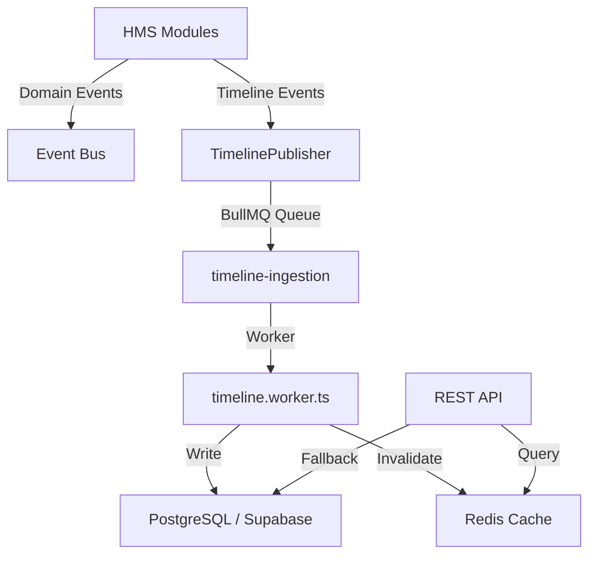

# Clinical Timeline Engine

This document outlines the architecture, data models, integration steps, and FHIR mapping guidelines for the Clinical Timeline Engine platform of Haspataal.

## 1. Architecture Overview

The Clinical Timeline Engine is an append-only event-driven system designed to serve as the single source of truth for longitudinal patient medical history.



- **Immutability**: Once an event is written, it is never modified or deleted. Amendments create new events pointing to the original (`amendedEventId`).
- **Traceability**: All events must publish `correlationId` (UUID) and `sourceSystem` fields.
- **Search**: Uses PostgreSQL `tsvector` + GIN index for search under 500ms p95.

---

## 2. Event Model & Database Schema

The core model is `TimelineEvent`:

| Field | Type | Description |
|---|---|---|
| `id` | UUID | Primary key |
| `patientId` | UUID | Associated patient |
| `hospitalId` | UUID | Scoping hospital (optional) |
| `eventType` | String | Type of event (e.g. `PrescriptionCreated`) |
| `category` | String | Clinical category (e.g. `PRESCRIPTION`) |
| `title` | String | Display title of the card |
| `severity` | Enum | `LOW`, `MEDIUM`, `HIGH`, `CRITICAL` |
| `correlationId`| UUID | Unique identifier for de-duplication |
| `integrityHash`| String | Cryptographic SHA-256 validation |

---

## 3. How to Publish an Event

To publish a clinical or administrative event to the timeline:

```typescript
import { getTimelinePublisher } from '@haspataal/timeline';

await getTimelinePublisher().publish({
  patientId: 'patient-uuid',
  hospitalId: 'hospital-uuid',
  eventType: 'PrescriptionCreated',
  title: 'Prescription Issued',
  subtitle: 'Dr. John Doe',
  category: 'PRESCRIPTION',
  module: 'prescriptions',
  severity: 'LOW',
  metadata: {
    drugs: 'Paracetamol 500mg, Amoxicillin 250mg',
  },
});
```

---

## 4. FHIR R4 Mapping

The ingestion worker automatically maps events to relevant FHIR resources based on the `fhirResourceType`:

- `LAB_COMPLETED` → `DiagnosticReport`
- `PRESCRIPTION_CREATED` → `MedicationRequest`
- `MAR_ADMINISTERED` → `MedicationAdministration`
- `PATIENT_ADMITTED`/`DISCHARGE_COMPLETED` → `Encounter`
