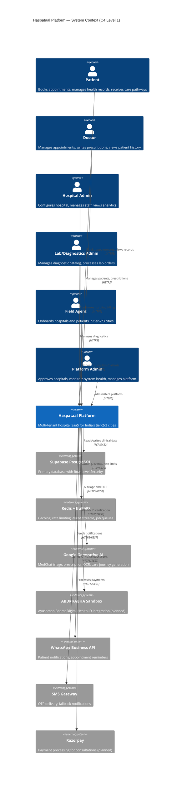
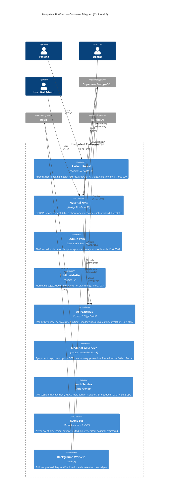
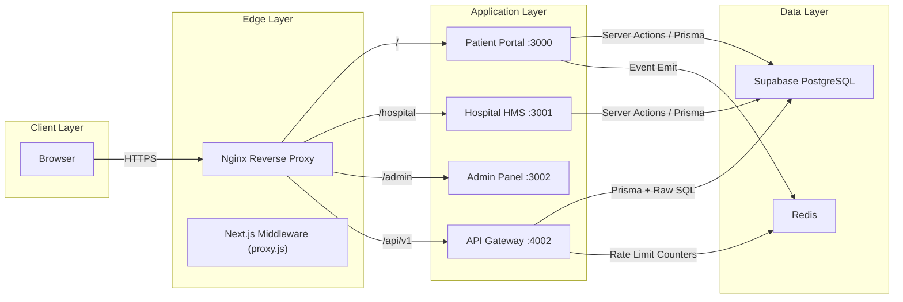
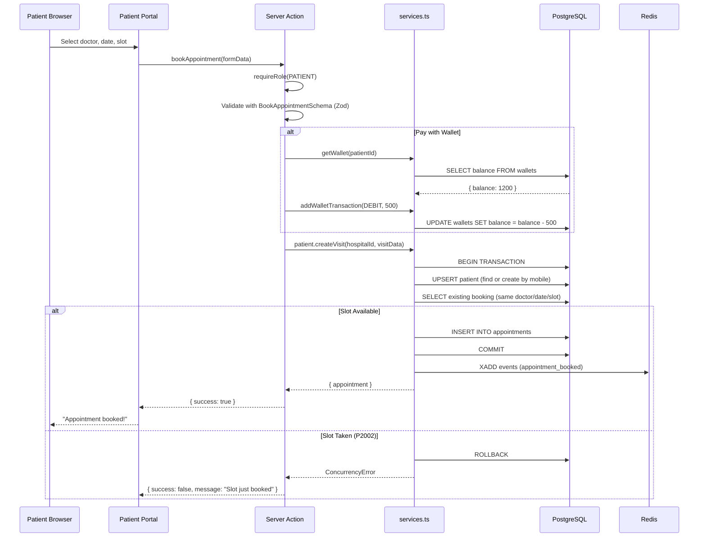
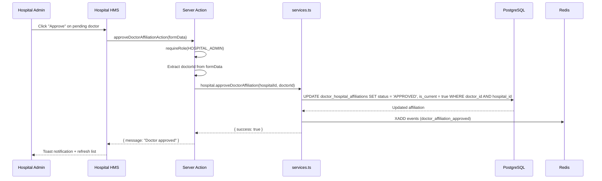
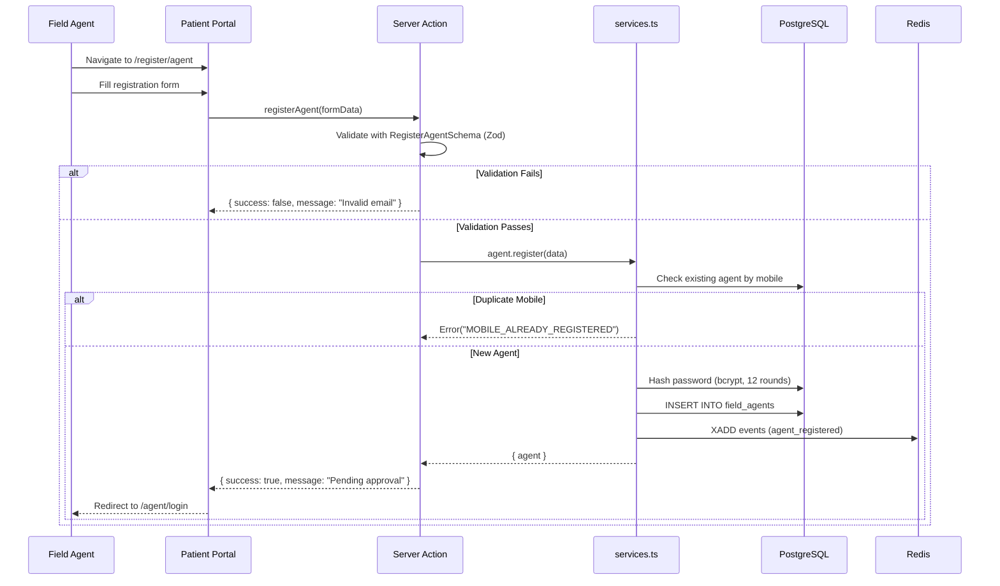
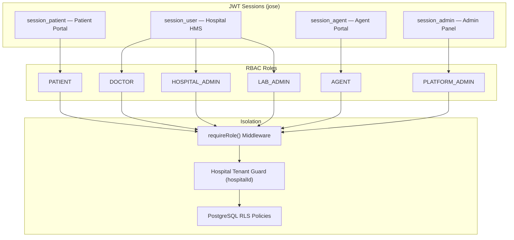
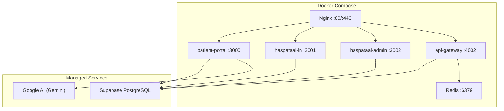

# Haspataal Platform — Architecture Documentation

## C4 Level 1: System Context

The system context shows the Haspataal platform, its users, and the external systems it integrates with.

---

## C4 Level 2: Container Diagram

The container diagram shows the runtime components that make up the Haspataal platform.

### Container Summary

| Container                            | Tech Stack                             | Port | Responsibility                                                           |
| ------------------------------------ | -------------------------------------- | ---- | ------------------------------------------------------------------------ |
| **Patient Portal**                   | Next.js 16, React 19, Tailwind, shadcn | 3000 | Booking, health records, MedChat AI, care timelines                      |
| **Hospital HMS** (`haspataal-in`)    | Next.js 16, React 19, Tailwind, shadcn | 3001 | OPD/IPD, billing, pharmacy, diagnostics, setup wizard                    |
| **Admin Panel** (`haspataal-admin`)  | Next.js 16, React 19, Tailwind         | 3002 | Hospital approvals, platform stats, user management                      |
| **Public Website** (`haspataal-com`) | Next.js 16                             | 3003 | Doctor discovery, hospital listings, SEO pages                           |
| **API Gateway**                      | Express 5, TypeScript, jose, Pino      | 4002 | JWT validation, per-role rate limits, CORS, proxying                     |
| **Event Bus**                        | Redis Streams, BullMQ                  | —    | Async events: `hospital_registered`, `patient_visited`, `bill_generated` |
| **Workers**                          | Node.js, BullMQ                        | —    | Follow-up scheduling, notification dispatch, retention                   |

### Communication Protocols

---

## Key Data Flows

### 1. Patient Booking an Appointment

### 2. Hospital Admin Approving a Doctor Affiliation

### 3. Agent Referral Registration

---

## Authentication & Authorization Model

---

## Deployment Topology

