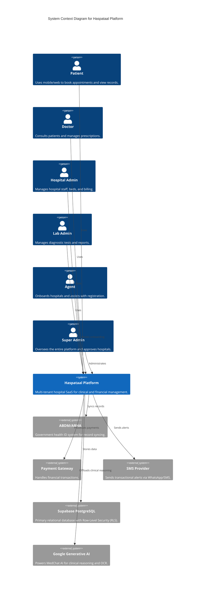
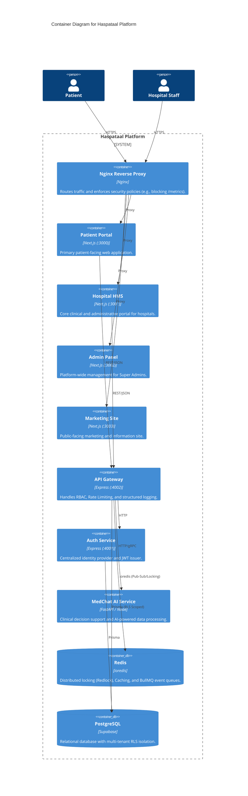
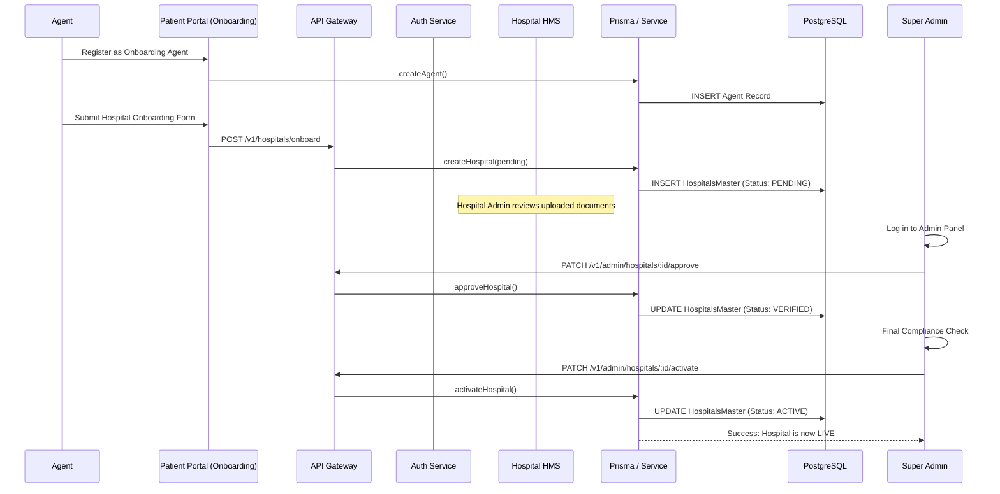
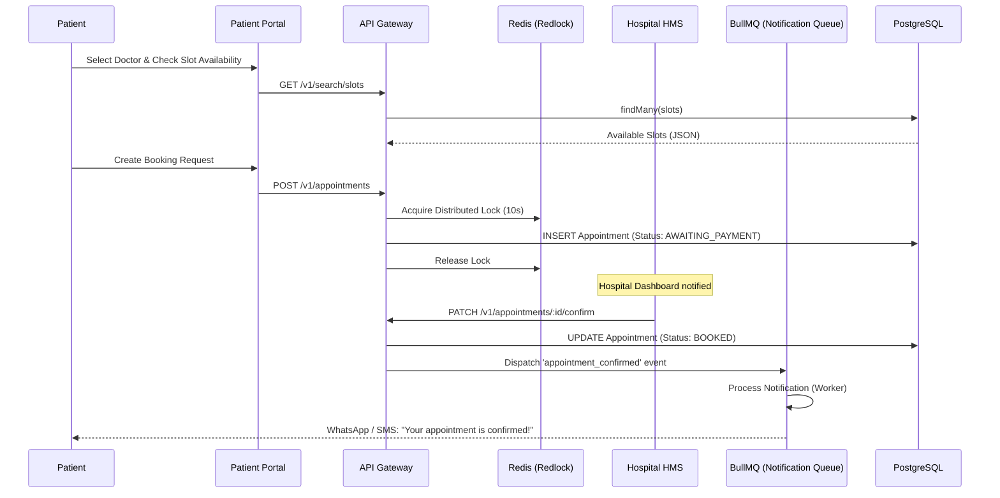

# 🏛️ Haspataal Architecture Documentation

This document provides a visual overview of the Haspataal platform architecture using the C4 model and detailed sequence diagrams.

## 📖 Legend

| Level | Name | Description |
| :--- | :--- | :--- |
| **L1** | **System Context** | High-level view showing the platform and its relationships with users and external systems. |
| **L2** | **Container Diagram** | Shows the high-level technology choices, how responsibilities are distributed, and how containers communicate. |
| **Sequence** | **Dynamic View** | Illustrates how specific business processes flow through the various components of the system. |

---

## 🌍 Diagram 1 — C4 Level 1: System Context
The primary goal of the Haspataal platform is to bridge the gap between patients and healthcare providers in Tier-2/3 cities.

---

## 📦 Diagram 2 — C4 Level 2: Container Diagram
Haspataal is built as a distributed monolith transitioning into a micro-architecture, orchestrated via Nginx.

---

## 🔄 Diagram 3 — Sequence: Doctor/Hospital Approval Flow
This flow ensures that every hospital and doctor on the platform undergoes a strict multi-tier verification process before becoming active.

---

## 📅 Diagram 4 — Sequence: Appointment Booking
Haspataal uses distributed locking to prevent overbooking and a resilient message queue for notifications.

