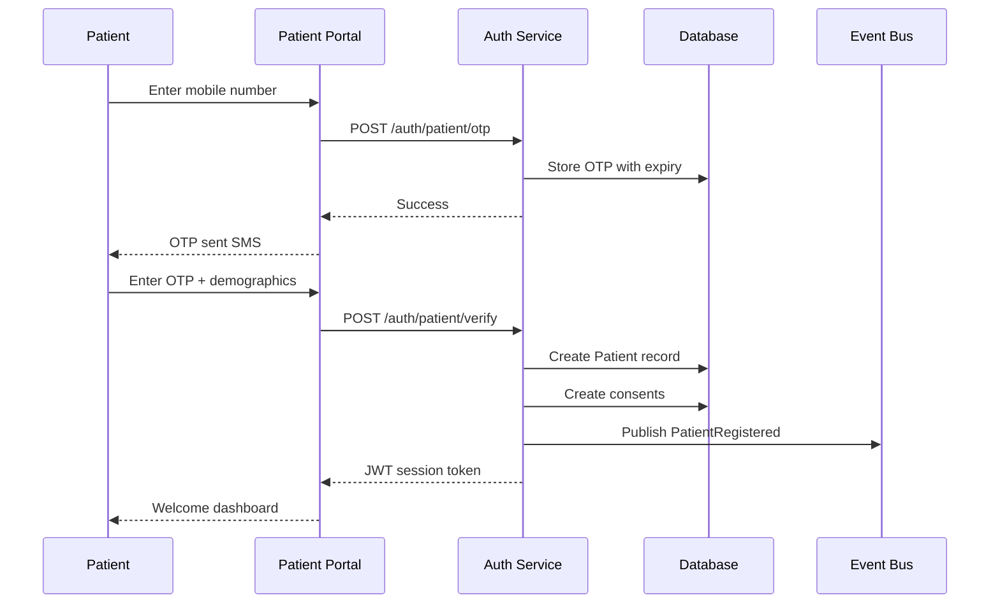
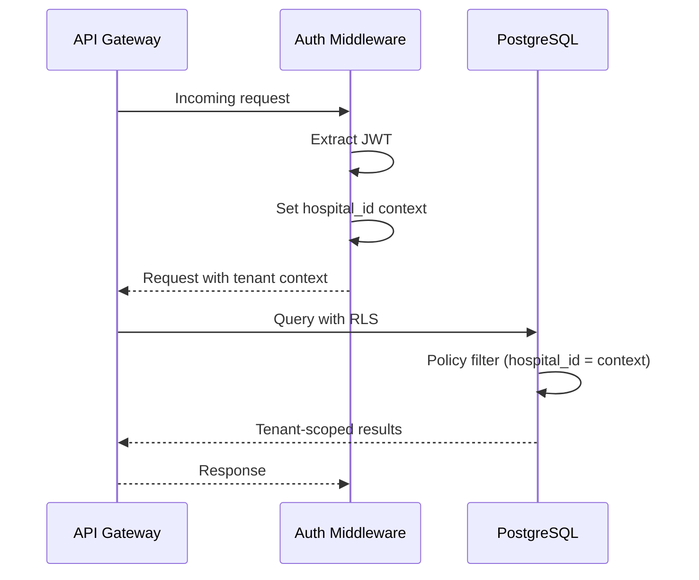

# Phase 1 Sequence Diagrams

## Patient Registration Flow



## Doctor Identity Registration Flow

```mermaid
sequenceDiagram
    participant D as Doctor
    participant DP as Doctor Portal
    participant AUTH as Auth Service
    DB as Database

    D->>DP: Enter mobile
    DP->>AUTH: Send OTP
    AUTH-->>DP: OTP sent
    D->>DP: Verify OTP + email/password

    DP->>DB: Create DoctorMaster (DRAFT)
    DP->>DB: Create DoctorProfile
    DP->>DB: Create DoctorRegistration

    Note over D,DB: Education/Experience/Documents

    D->>DP: Submit documents
    DP->>DB: Create DoctorDocument (ENCRYPTED)
    DP->>DB: Set verification to UNDER_VERIFICATION

    Note over DB: Admin reviews
    DB->>DB: Status → VERIFIED or REJECTED
```

## Hospital Onboarding Flow

```mermaid
sequenceDiagram
    participant HA as Hospital Admin
    participant HMS as HMS Portal
    participant AUTH as Auth Service
    DB as Database

    HA->>HMS: Start setup wizard
    HMS->>DB: Create HospitalsMaster (PENDING)
    HMS->>DB: HospitalProfile wizard data
    HMS->>DB: Create Departments
    HMS->>DB: Staff roster import

    HMS->>DB: Configure branding
    HMS->>DB: Configure OPD settings
    HMS->>DB: Configure holidays

    Note over HMS: Validation check
    HMS->>DB: Set accountStatus = ACTIVE
    HMS-->>HA: Setup complete - Go live
```

## Multi-Tenant Query Flow

