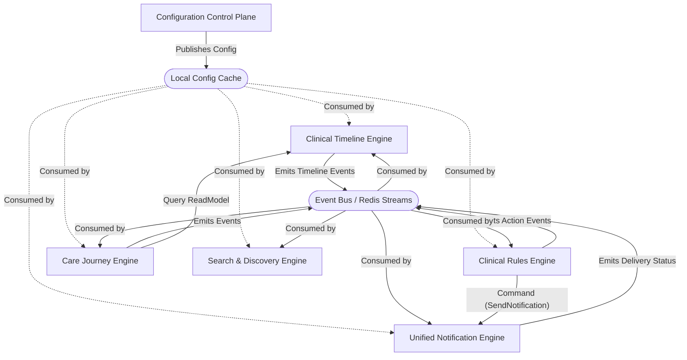

# Dependency Audit

This document maps all six engines as a directed graph and classifies dependencies.

## Allowed Dependencies
- **Contract dependency**: Dependent on `packages/platform-contracts`.
- **Query dependency**: Asynchronous requests for explicitly exposed Read Models.
- **Command dependency**: Intent dispatch (e.g. `SendNotification`).
- **Event dependency**: Listening to Event Bus for `occurredAt` triggers.
- **Configuration dependency**: Reading from Configuration Engine cache/local resolver.

## High Risk Dependencies
- **Synchronous runtime dependency**: Direct API calls that could block if target is down.
- **Transitive dependency chain**: A -> B -> C (latency multiplier).

## Forbidden Dependencies (Action Required)
- **Direct cross-engine table access**: E.g. Rules Engine directly querying `patients` table.
- **Circular package imports**: A imports B, B imports A.
- **Shared mutable domain models**: Modifying a Prisma object passed between engines.

## Runtime Dependency Graph (Ideal Target State)

## Existing Codebase Dependency Assessment

Based on the inventory:
- **Cross-Engine Table Access**: Currently, engines might be using `@haspataal/db` singleton directly. This is **Forbidden**. Engines should only access their own schema bounds or use dedicated Read Projections.
- **Configuration Resolution**: Currently relying on `HospitalsMaster` and DB lookups. Needs to transition to the `ConfigCache` model.
- **Circular Dependencies**: If Rules trigger a Journey which triggers a Rule, this could lead to infinite loops. Need strict causation tracking.

*Note: Every circular dependency must be resolved via the EventBus using idempotent consumers before portal integration.*
