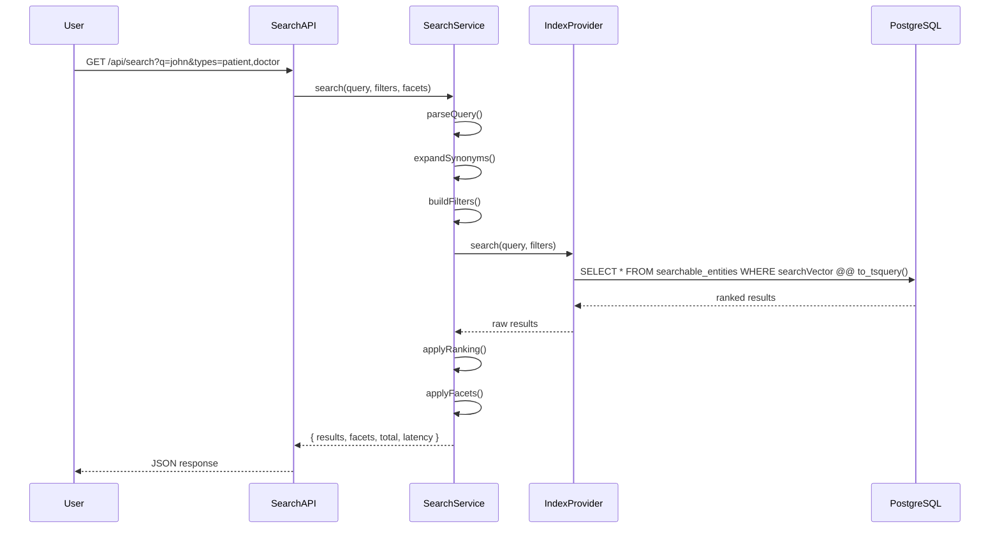
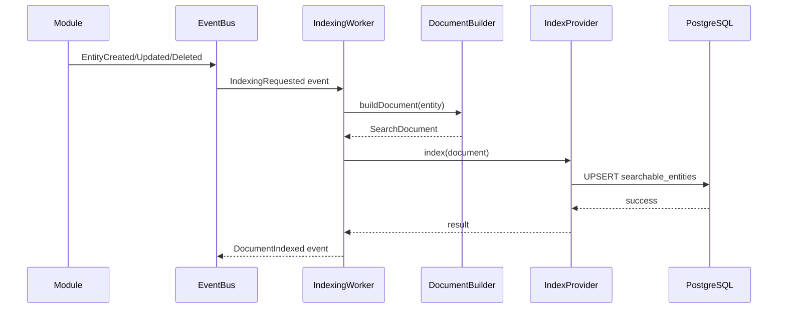
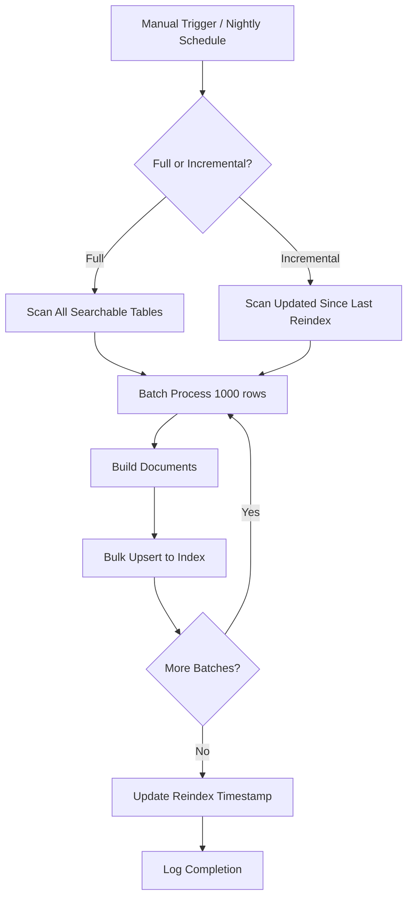
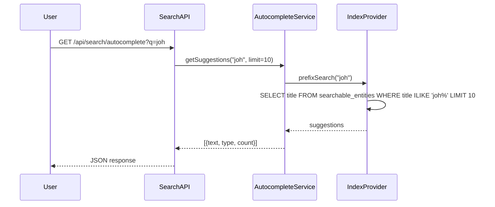
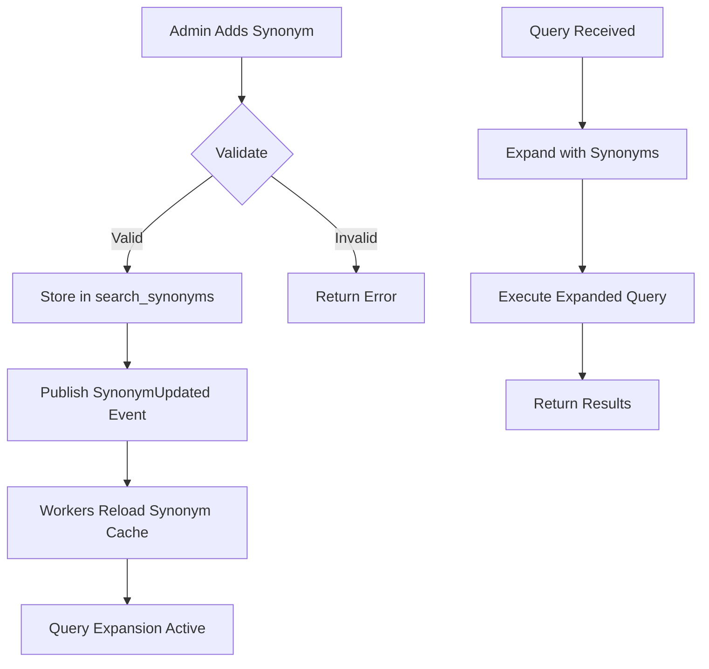

# Unified Search & Discovery Platform - Workflow & Operations

## Search Workflow

## Indexing Workflow

## Reindex Workflow

## Autocomplete Workflow

## Synonym Management Workflow

## Error Handling

| Scenario | Handling |
|----------|----------|
| IndexProvider unavailable | Fallback to cached results, queue for retry |
| Document build failure | Log error, dead letter queue, alert |
| Synonym expansion timeout | Skip expansion, search original query |
| Rank calculation error | Use default ranking, log for review |
| RLS policy violation | Deny query, log security event |

## Performance Targets

| Operation | Target | Measurement |
|----------|--------|-------------|
| Search query | p95 < 100ms | Percentile from SearchLog |
| Autocomplete | p95 < 50ms | Percentile from SearchLog |
| Index write | < 200ms | BullMQ job duration |
| Full reindex (1M docs) | < 30 min | Job duration |
| Synonym reload | < 5s | Worker reload time |

## Monitoring & Alerts

| Metric | Alert Threshold |
|--------|-----------------|
| Search latency p95 | > 200ms for 5 min |
| Index lag | > 5 min |
| Zero-result rate | > 20% for 10 min |
| Indexing queue depth | > 10,000 |
| Error rate | > 1% for 5 min |